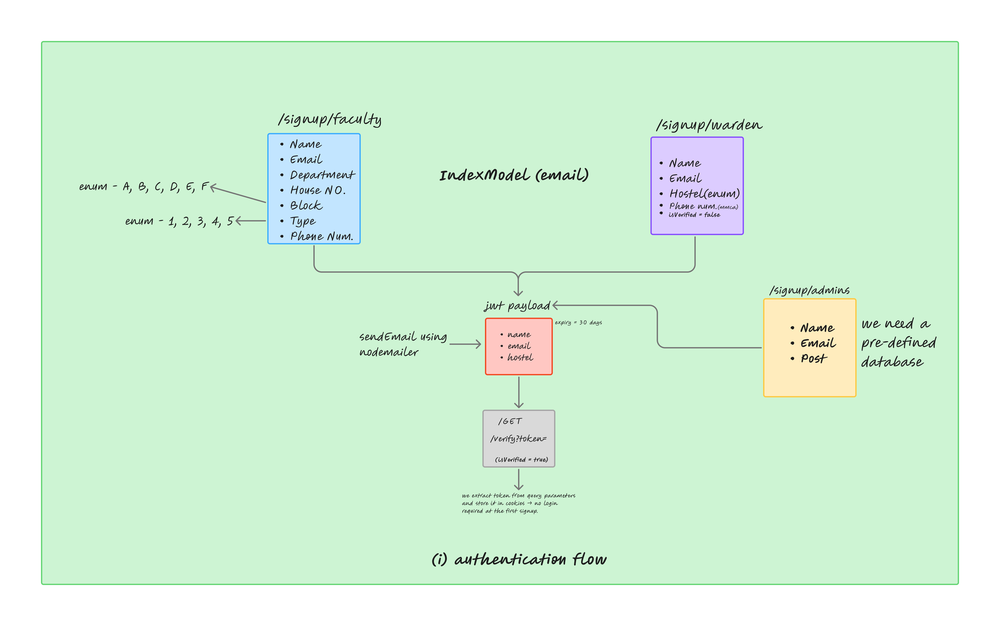

# CMS Web
the official web interface of the Estate Office of NIT Hamirpur to manage complaints. civil/electrical. official/residential
(in development)

## Architecture

### Role based authorization

### Authentication flow

### Complaint flow

### Request status (XEN, JE)

### Request status (AE)

### Complaint status public dashboard

<!-- Automated CI/CD Deployment Trigger v2 -->